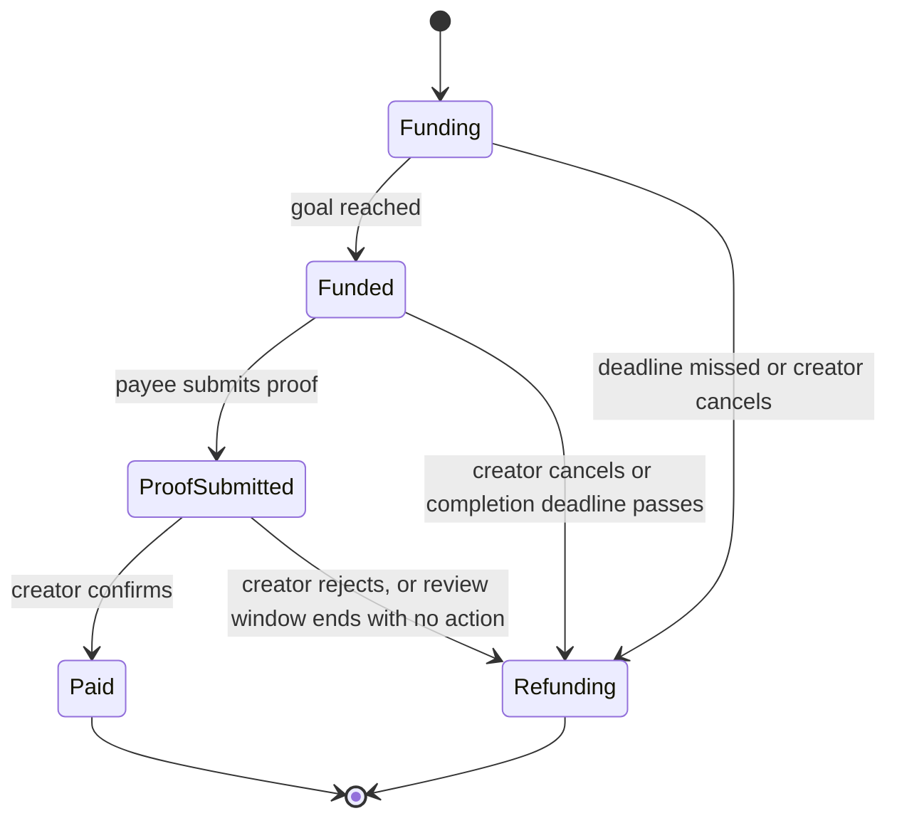

# Spec

Raise it, fund it, and a neighbour or local business gets paid to do it.

## The MVP: street events

A resident creates a campaign for a street event, for example: "Bouncy castle for the street party, 150 USDC, Saturday 10 Oct." The payee is the local business or neighbour providing it. Neighbours chip in, and local businesses can chip in too as named sponsors.

- Goal reached: the booking is on, and the money is locked in.
- After the event, the provider posts a photo of themselves at the event as proof, the creator confirms the job was done, and the money is released to the provider.
- Goal missed, or the event cancelled (rain, for example): every backer gets their money back by pressing a claim button.
- Before the goal is reached, a backer can pull their money out at any time for a 3% fee. The fee stays in the campaign pot for the street. Once the goal is reached, everything is locked until the outcome.

The provider can see the money is already locked before they turn up. That is the pitch to local businesses.

## Other campaign types (same contract)

The contract treats every campaign the same way. The type is only a label for the UI.

- **Event** (hero): street party, fair, beach clean-up, kids' football day.
- **Community project**: a play area, after-school classes, fixing a pothole.
- **Job**: one backer, one worker (lawn, odd jobs).

## Roles

- **Creator**: sets up the campaign, assigns the payee, confirms or rejects the proof, can cancel before proof is submitted.
- **Backer**: anyone who chips in USDC. A business backer is shown by name as a sponsor. Can pull out (minus the fee) while the campaign is still raising.
- **Payee**: the neighbour or business doing the work. Cannot be the creator. Submits the proof.

## Campaign lifecycle

## Contract rules

1. **Create.** The creator sets: metadata URI (title, description, image, type), goal, funding deadline, completion deadline, review window length, and optionally the payee. The stablecoin address is a deployment parameter, never hard-coded in logic: USDC is the target, and the same contract must work with any ERC-20 stablecoin.
2. **Contribute.** Only while Funding and before the funding deadline. A contribution is capped at the amount still needed, so there is no overfunding. Reaching the goal moves the campaign to Funded straight away.
3. **Withdraw.** Backer only, only while Funding. The backer receives their contribution minus the withdrawal fee (3%, set at creation); the fee stays in the campaign pot and counts towards nothing, it is simply extra money for the outcome. Once Funded, withdrawals revert.
4. **Assign payee.** Creator only, before proof is submitted. The payee cannot be the zero address or the creator.
5. **Submit proof.** Payee only, while Funded and before the completion deadline. Stores a proof URI (the photo of the provider at the event) and starts the review window.
6. **Confirm or reject.** Creator only, during the review window. Confirm pays the full pot (contributions plus retained fees) to the payee. Reject moves the campaign to Refunding.
7. **Review timeout.** Anyone can call it after the review window ends with no decision. The campaign moves to Refunding: if nobody presses anything, the money goes back to the street.
8. **Cancel.** Creator only, while Funding or Funded. Moves to Refunding.
9. **Expire.** Anyone can call it if the campaign is Funded and the completion deadline has passed with no proof. Moves to Refunding.
10. **Refund.** In Refunding, each backer calls `claimRefund` once and receives what they contributed plus their pro-rata share of any retained withdrawal fees.
11. No platform fees, no admin, no early withdrawal by the creator, no owner who can move funds.

**Decisions recorded 24 Sep (Joel):** proof is the provider's job, a photo of them at the event; release is confirmed by the creator, not a backer vote (backer voting moves to the roadmap); if nobody acts in the review window the money refunds; pull-outs are allowed with a 3% fee only until the goal is reached, locked after; the contract is token-agnostic with USDC as the target.

**Events to emit:** CampaignCreated, Contributed, Withdrawn, PayeeAssigned, ProofSubmitted, Confirmed, Rejected, Paid, RefundingStarted, Refunded. These power the profile and reputation screen later.

### Required tests

- Goal reached exactly moves to Funded
- Contribution above the remaining amount is capped
- Contribution after the funding deadline reverts
- Withdrawal while Funding returns contribution minus fee; fee remains in the pot
- Withdrawal once Funded reverts; withdrawal by a non-backer reverts; withdrawing more than contributed reverts
- Missed goal allows refunds; claiming twice reverts
- Refund includes pro-rata share of retained fees
- Creator assigned as payee reverts
- Confirm by anyone other than the creator reverts
- Confirm pays the payee the full pot including retained fees
- Reject moves to Refunding
- Review window ending with no decision moves to Refunding
- Cancel after proof submitted reverts
- Expiry with no proof moves to Refunding
- Reentrancy attempt on `claimRefund` fails

## Off-chain data

Campaign text, images and proof photos live off-chain. The contract stores only the metadata URI and the proof URI. Use the simplest free option that works with Vercel, and propose it to Joel before adding any new service.

## Wallets and funds

- Email-login wallets from the Crossmint quickstart.
- USDC is the target: test USDC from Circle's faucet, address in `.env`, never hard-coded. If the Crossmint wallets cannot hold or send Circle's USDC, fall back to USDXM (Crossmint's staging stablecoin) and record that in the README. Verify with a real transaction before the contract is written.
- Check whether the quickstart sponsors gas. If not, fund each wallet with a small amount of Base Sepolia ETH.

## Screens (mobile first)

1. **Street feed:** all campaigns, events first.
2. **Create campaign:** type, title, description, photo, goal, deadlines, provider.
3. **Campaign page:** progress bar, backers (businesses shown as sponsors), chip-in button, pull-out button (with the fee stated plainly) while raising, status, countdown.
4. **Provider view:** submit proof photo.
5. **Review** (creator only): the proof photo, confirm or reject, window countdown.
6. **Outcome:** paid (with a link to the transaction on the explorer) or refunded (claim-refund button).
7. **Profile** (lowest priority): campaigns backed and jobs completed, read from contract events.

## Only if ahead of schedule

- Free "I'm in" RSVP for neighbours who can't chip in, shown on the event page.

## Roadmap (not in the MVP)

- Backer voting on proof for campaigns bigger than one street, so release doesn't rest on one person
- Stronger proof verification: photo location data, backer check-ins at the event, or a second confirmer
- Agents that pledge to local campaigns within their owner's limits
- Staged payouts (part on booking, the rest on completion), which vendors will expect
- Surplus funds rolling into a street pot for the next event
- Proof-of-attendance keepsakes for event backers
- Volunteer-hour pledges alongside money
- Platform fee on business payouts; verified provider listings
- One-person-one-vote and protection against fake wallets
- Lending with refundable deposits
- Projects on public land (potholes) may need local council approval; check before promoting them
